# Database Schema — HRMS

> **Document Version:** 1.0  
> **Last Updated:** March 6, 2026  
> **Author:** Senior Developer  
> **Database:** MongoDB 7 — `EmployeeCleanDB`

---

## Table of Contents

1. [Overview](#1-overview)
2. [BaseEntity — Common Fields](#2-baseentity--common-fields)
3. [Identity Collections](#3-identity-collections)
   - 3.1 [users](#31-users)
   - 3.2 [roles](#32-roles)
4. [Organization Module](#4-organization-module)
   - 4.1 [departments](#41-departments)
   - 4.2 [positions](#42-positions)
5. [Human Resource Module](#5-human-resource-module)
   - 5.1 [employees](#51-employees)
   - 5.2 [contracts](#52-contracts)
6. [Recruitment Module](#6-recruitment-module)
   - 6.1 [job_vacancies](#61-job_vacancies)
   - 6.2 [candidates](#62-candidates)
   - 6.3 [interviews](#63-interviews)
7. [Attendance Module](#7-attendance-module)
   - 7.1 [shifts](#71-shifts)
   - 7.2 [raw_attendance_logs](#72-raw_attendance_logs)
   - 7.3 [attendance_buckets](#73-attendance_buckets)
8. [Leave Management Module](#8-leave-management-module)
   - 8.1 [leave_types](#81-leave_types)
   - 8.2 [leave_allocations](#82-leave_allocations)
   - 8.3 [leave_requests](#83-leave_requests)
9. [Payroll Module](#9-payroll-module)
   - 9.1 [public_holidays](#91-public_holidays)
   - 9.2 [payroll_cycles](#92-payroll_cycles)
   - 9.3 [payrolls](#93-payrolls)
10. [Performance Module](#10-performance-module)
    - 10.1 [performance_reviews](#101-performance_reviews)
    - 10.2 [performance_goals](#102-performance_goals)
11. [Notification & System Module](#11-notification--system-module)
    - 11.1 [notifications](#111-notifications)
    - 11.2 [audit_logs](#112-audit_logs)
    - 11.3 [system_settings](#113-system_settings)
12. [Enum Reference](#12-enum-reference)
13. [Relationships Diagram](#13-relationships-diagram)
    - 13.1 [ASCII Overview](#131-ascii-overview)
    - 13.2 [Visual ER Diagram — Mermaid](#132-visual-er-diagram--mermaid)
14. [Indexing Strategy](#14-indexing-strategy)
15. [Design Decisions & Patterns](#15-design-decisions--patterns)

---

## 1. Overview

| Property | Value |
|---|---|
| Database Engine | MongoDB 7 |
| Database Name | `EmployeeCleanDB` |
| Driver | MongoDB.Driver 3.6.0 (.NET) |
| ID Type | BSON ObjectId → serialized as `string` trong Domain |
| Enum Storage | String (e.g., `"Active"` thay vì `0`) |
| Soft Delete | Tất cả collections đều có field `isDeleted` |
| Timezone | UTC (datetime lưu UTC, tính toán dùng `SE Asia Standard Time` UTC+7) |

**Tổng số collections: 22**

| # | Collection | Module | Entity |
|---|---|---|---|
| 1 | `users` | Identity | `ApplicationUser` |
| 2 | `roles` | Identity | `ApplicationRole` |
| 3 | `departments` | Organization | `Department` |
| 4 | `positions` | Organization | `Position` |
| 5 | `employees` | Human Resource | `EmployeeEntity` |
| 6 | `contracts` | Human Resource | `ContractEntity` |
| 7 | `job_vacancies` | Recruitment | `JobVacancy` |
| 8 | `candidates` | Recruitment | `Candidate` |
| 9 | `interviews` | Recruitment | `Interview` |
| 10 | `shifts` | Attendance | `Shift` |
| 11 | `raw_attendance_logs` | Attendance | `RawAttendanceLog` |
| 12 | `attendance_buckets` | Attendance | `AttendanceBucket` |
| 13 | `leave_types` | Leave | `LeaveType` |
| 14 | `leave_allocations` | Leave | `LeaveAllocation` |
| 15 | `leave_requests` | Leave | `LeaveRequest` |
| 16 | `public_holidays` | Payroll | `PublicHoliday` |
| 17 | `payroll_cycles` | Payroll | `PayrollCycle` |
| 18 | `payrolls` | Payroll | `PayrollEntity` |
| 19 | `performance_reviews` | Performance | `PerformanceReview` |
| 20 | `performance_goals` | Performance | `PerformanceGoal` |
| 21 | `notifications` | Notification | `Notification` |
| 22 | `audit_logs` | System | `AuditLog` |
| 23 | `system_settings` | System | `SystemSetting` |

---

## 2. BaseEntity — Common Fields

Tất cả documents (trừ Identity) đều kế thừa `BaseEntity` với các field sau:

| Field (BSON) | Type | Required | Mô tả |
|---|---|---|---|
| `_id` | ObjectId | ✅ | Primary key — map thành `string Id` trong Domain |
| `isDeleted` | bool | ✅ | Soft delete flag. Default: `false` |
| `createdAt` | DateTime (UTC) | ✅ | Thời điểm tạo record |
| `createdBy` | string | ✅ | UserId hoặc `"System"` nếu tạo bởi background job |
| `updatedAt` | DateTime? (UTC) | ❌ | Thời điểm cập nhật cuối |
| `updatedBy` | string? | ❌ | UserId cập nhật cuối |
| `version` | int | ✅ | Optimistic concurrency version. Default: `1` |

> **Lưu ý:** `SoftDeleteFilter` trong Infrastructure tự động inject `{ isDeleted: false }` vào **mọi** query, trừ khi gọi trực tiếp unfiltered collection.

---

## 3. Identity Collections

### 3.1 `users`

**Entity:** `ApplicationUser` (extends `MongoIdentityUser<Guid>`)  
Quản lý bởi **ASP.NET Core Identity + MongoDbCore**.

```json
{
  "_id": "UUID",
  "userName": "nva@company.com",
  "normalizedUserName": "NVA@COMPANY.COM",
  "email": "nva@company.com",
  "normalizedEmail": "NVA@COMPANY.COM",
  "emailConfirmed": true,
  "passwordHash": "<bcrypt hash>",
  "securityStamp": "...",
  "concurrencyStamp": "...",
  "phoneNumber": null,
  "phoneNumberConfirmed": false,
  "twoFactorEnabled": false,
  "lockoutEnd": null,
  "lockoutEnabled": true,
  "accessFailedCount": 0,
  "roles": ["Admin"],
  "claims": [],
  "logins": [],
  "tokens": [],

  // Custom fields (ApplicationUser)
  "fullName": "Nguyen Van A",
  "employeeId": "ObjectId | null",
  "isActive": true,
  "mustChangePassword": false,
  "refreshTokens": [
    {
      "tokenHash": "<SHA-256 hash>",
      "familyId": "uuid-v4",
      "issuedAt": "ISODate",
      "expiresAt": "ISODate",
      "isRevoked": false
    }
  ]
}
```

| Field | Type | Mô tả |
|---|---|---|
| `_id` | UUID (Guid) | Identity ID — khác với ObjectId của Domain |
| `fullName` | string | Tên hiển thị |
| `employeeId` | string? | Reference đến `employees._id` (nullable nếu là admin system) |
| `isActive` | bool | Kích hoạt/khóa tài khoản |
| `mustChangePassword` | bool | Buộc đổi mật khẩu lần đăng nhập tiếp theo |
| `refreshTokens` | `RefreshTokenEntry[]` | Danh sách refresh token embedded (max ~10 entries) |
| `refreshTokens[].tokenHash` | string | SHA-256 hash của raw token — không bao giờ lưu plain text |
| `refreshTokens[].familyId` | string | UUID nhóm các rotation trong cùng 1 login session |
| `refreshTokens[].isRevoked` | bool | Token đã bị thu hồi / đã dùng |

**Password Policy:**
- Minimum 8 ký tự
- Phải có chữ hoa, chữ thường, chữ số
- Account lockout: 5 lần sai → lock 15 phút

### 3.2 `roles`

**Entity:** `ApplicationRole` (extends `MongoIdentityRole<Guid>`)

```json
{
  "_id": "UUID",
  "name": "Admin",
  "normalizedName": "ADMIN",
  "concurrencyStamp": "..."
}
```

**Roles hệ thống:**

| Role | Mô tả |
|---|---|
| `Admin` | Toàn quyền hệ thống |
| `HR` | Quản lý nhân sự, lương, nghỉ phép |
| `Manager` | Xem team, duyệt đơn, xem chấm công |
| `Employee` | Self-service: check-in, xin nghỉ, xem thông tin cá nhân |

---

## 4. Organization Module

### 4.1 `departments`

**Entity:** `Department`

```json
{
  "_id": "ObjectId",
  "name": "Engineering",
  "code": "ENG",
  "description": "Software Engineering Department",
  "managerId": "ObjectId | null",
  "parentId": "ObjectId | null",
  "isDeleted": false,
  "createdAt": "ISODate",
  "createdBy": "userId",
  "updatedAt": "ISODate | null",
  "updatedBy": "string | null",
  "version": 1
}
```

| Field | Type | Required | Mô tả |
|---|---|---|---|
| `name` | string | ✅ | Tên phòng ban |
| `code` | string | ✅ | Mã phòng ban (ngắn, duy nhất) |
| `description` | string | ❌ | Mô tả |
| `managerId` | ObjectId ref | ❌ | → `employees._id` — Trưởng phòng |
| `parentId` | ObjectId ref | ❌ | → `departments._id` — Phòng ban cha (cây tổ chức đệ quy) |

**Quan hệ:**
- `managerId` → `employees._id` (n-1)
- `parentId` → `departments._id` (self-referencing tree)

### 4.2 `positions`

**Entity:** `Position`

```json
{
  "_id": "ObjectId",
  "title": "Senior Software Engineer",
  "code": "SSE",
  "departmentId": "ObjectId",
  "parentId": "ObjectId | null",
  "salaryRange": {
    "min": 20000000,
    "max": 40000000,
    "currency": "VND"
  },
  "isDeleted": false,
  "createdAt": "ISODate",
  ...
}
```

| Field | Type | Required | Mô tả |
|---|---|---|---|
| `title` | string | ✅ | Tên chức vụ |
| `code` | string | ✅ | Mã chức vụ |
| `departmentId` | ObjectId ref | ✅ | → `departments._id` |
| `parentId` | ObjectId ref | ❌ | → `positions._id` — Chức vụ quản lý trực tiếp |
| `salaryRange.min` | decimal | ✅ | Mức lương tối thiểu |
| `salaryRange.max` | decimal | ✅ | Mức lương tối đa |
| `salaryRange.currency` | string | ✅ | Default: `"VND"` |

---

## 5. Human Resource Module

### 5.1 `employees`

**Entity:** `EmployeeEntity`  
Document trung tâm của hệ thống — embed thông tin cá nhân, công việc, ngân hàng.

```json
{
  "_id": "ObjectId",
  "employeeCode": "EMP001",
  "fullName": "Nguyen Van A",
  "email": "nva@company.com",
  "avatarUrl": "https://storage.../avatar.jpg | null",

  "personalInfo": {
    "dob": "ISODate",
    "gender": "Male",
    "phone": "0901234567",
    "address": "123 Le Loi, Q1, TP.HCM",
    "identityCard": "012345678901",
    "maritalStatus": "Single",
    "nationality": "Vietnamese",
    "hometown": "Ha Noi",
    "country": "Vietnam",
    "city": "Ho Chi Minh",
    "postalCode": "70000",
    "dependentCount": 1
  },

  "jobDetails": {
    "departmentId": "ObjectId",
    "positionId": "ObjectId",
    "managerId": "ObjectId",
    "shiftId": "ObjectId",
    "joinDate": "ISODate",
    "status": "Active",
    "resumeUrl": "https://... | null",
    "contractUrl": "https://... | null",
    "probationEndDate": "ISODate | null"
  },

  "bankDetails": {
    "bankName": "Vietcombank",
    "accountNumber": "0123456789",
    "accountHolder": "NGUYEN VAN A",
    "insuranceCode": "VN1234567890",
    "taxCode": "8901234567"
  },

  "isDeleted": false,
  "createdAt": "ISODate",
  "createdBy": "userId",
  "updatedAt": "ISODate | null",
  "updatedBy": "string | null",
  "version": 1
}
```

**Embedded: `personalInfo`**

| Field | Type | Mô tả |
|---|---|---|
| `dob` | DateTime (UTC) | Ngày sinh — phải >= 18 tuổi (domain rule) |
| `gender` | string | "Male" / "Female" / "Other" |
| `phone` | string | Số điện thoại |
| `address` | string | Địa chỉ hiện tại |
| `identityCard` | string | CCCD/CMND |
| `maritalStatus` | string | "Single" / "Married" / "Divorced" |
| `nationality` | string | Quốc tịch |
| `hometown` | string | Quê quán |
| `country` | string | Quốc gia |
| `city` | string | Thành phố |
| `postalCode` | string | Mã bưu chính |
| `dependentCount` | int | Số người phụ thuộc (dùng tính PIT giảm trừ) |

**Embedded: `jobDetails`**

| Field | Type | Mô tả |
|---|---|---|
| `departmentId` | ObjectId ref | → `departments._id` |
| `positionId` | ObjectId ref | → `positions._id` |
| `managerId` | ObjectId ref | → `employees._id` (manager trực tiếp) |
| `shiftId` | ObjectId ref | → `shifts._id` |
| `joinDate` | DateTime | Ngày vào làm |
| `status` | EmployeeStatus (string) | Xem Enum Reference |
| `resumeUrl` | string? | URL hồ sơ |
| `contractUrl` | string? | URL hợp đồng scan |
| `probationEndDate` | DateTime? | Ngày kết thúc thử việc |

**Embedded: `bankDetails`**

| Field | Type | Mô tả |
|---|---|---|
| `bankName` | string | Tên ngân hàng |
| `accountNumber` | string | Số tài khoản |
| `accountHolder` | string | Tên chủ tài khoản (in hoa) |
| `insuranceCode` | string | Mã số BHXH |
| `taxCode` | string | Mã số thuế cá nhân |

**Domain Rule:** `personalInfo.dob` phải được set sao cho nhân viên >= 18 tuổi tại thời điểm cập nhật.

### 5.2 `contracts`

**Entity:** `ContractEntity`

```json
{
  "_id": "ObjectId",
  "employeeId": "ObjectId",
  "contractCode": "CTR-2026-001",
  "type": "Fixed-Term",
  "startDate": "ISODate",
  "endDate": "ISODate | null",
  "status": "Active",
  "note": "string | null",
  "fileUrl": "https://... | null",
  "salary": {
    "basicSalary": 15000000,
    "transportAllowance": 1000000,
    "lunchAllowance": 800000,
    "otherAllowance": 500000
  },
  "isDeleted": false,
  "createdAt": "ISODate",
  ...
}
```

| Field | Type | Required | Mô tả |
|---|---|---|---|
| `employeeId` | ObjectId ref | ✅ | → `employees._id` |
| `contractCode` | string | ✅ | Mã hợp đồng (unique) |
| `type` | string | ✅ | "Fixed-Term" / "Indefinite" / "Probation" |
| `startDate` | DateTime | ✅ | Ngày hiệu lực |
| `endDate` | DateTime? | ❌ | Null nếu là hợp đồng không xác định thời hạn |
| `status` | ContractStatus (string) | ✅ | Draft → Pending → Active → Expired/Terminated |
| `note` | string? | ❌ | Ghi chú (lý do chấm dứt, v.v.) |
| `fileUrl` | string? | ❌ | URL file hợp đồng scan |
| `salary.basicSalary` | decimal | ✅ | Lương cơ bản (VND) |
| `salary.transportAllowance` | decimal | ❌ | Phụ cấp đi lại |
| `salary.lunchAllowance` | decimal | ❌ | Phụ cấp ăn trưa |
| `salary.otherAllowance` | decimal | ❌ | Các phụ cấp khác |

**State Machine (ContractStatus):**
```
Draft ──activate()──► Active
Draft ──schedule()──► Pending ──activate() [by bg job on StartDate]──► Active
Active ──expire() [by bg job]──► Expired
Active ──terminate()──► Terminated
```

---

## 6. Recruitment Module

### 6.1 `job_vacancies`

**Entity:** `JobVacancy`

```json
{
  "_id": "ObjectId",
  "title": "Senior Backend Developer",
  "description": "We are looking for...",
  "vacancies": 2,
  "expiredDate": "ISODate",
  "status": "Open",
  "requirements": [
    "3+ years .NET experience",
    "MongoDB knowledge"
  ],
  "isDeleted": false,
  "createdAt": "ISODate",
  ...
}
```

| Field | Type | Required | Mô tả |
|---|---|---|---|
| `title` | string | ✅ | Tên vị trí tuyển dụng |
| `description` | string | ❌ | Mô tả công việc |
| `vacancies` | int | ✅ | Số lượng tuyển (> 0) |
| `expiredDate` | DateTime | ✅ | Hạn nộp hồ sơ |
| `status` | JobVacancyStatus (string) | ✅ | Draft / Open / Closed |
| `requirements` | string[] | ❌ | Danh sách yêu cầu ứng viên |

### 6.2 `candidates`

**Entity:** `Candidate`

```json
{
  "_id": "ObjectId",
  "fullName": "Tran Thi B",
  "email": "ttb@gmail.com",
  "phone": "0912345678",
  "jobVacancyId": "ObjectId",
  "status": "Applied",
  "resumeUrl": "https://storage.../resume.pdf",
  "appliedDate": "ISODate",
  "isDeleted": false,
  "createdAt": "ISODate",
  ...
}
```

| Field | Type | Required | Mô tả |
|---|---|---|---|
| `fullName` | string | ✅ | Họ tên ứng viên |
| `email` | string | ✅ | Email liên hệ |
| `phone` | string | ✅ | Số điện thoại |
| `jobVacancyId` | ObjectId ref | ✅ | → `job_vacancies._id` |
| `status` | CandidateStatus (string) | ✅ | Xem Pipeline bên dưới |
| `resumeUrl` | string | ❌ | URL CV/Hồ sơ |
| `appliedDate` | DateTime | ✅ | Ngày nộp hồ sơ |

**Candidate Pipeline (State Machine):**
```
Applied ──► Interviewing ──► Test ──► Hired ──► Onboarded
   │             │              │       │
   └────────────►└──────────────►└───────►── Rejected (terminal)
```

### 6.3 `interviews`

**Entity:** `Interview`

```json
{
  "_id": "ObjectId",
  "candidateId": "ObjectId",
  "interviewerId": "ObjectId",
  "scheduledTime": "ISODate",
  "durationMinutes": 60,
  "location": "Online / Room 201",
  "status": "Scheduled",
  "feedback": "",
  "isDeleted": false,
  "createdAt": "ISODate",
  ...
}
```

| Field | Type | Required | Mô tả |
|---|---|---|---|
| `candidateId` | ObjectId ref | ✅ | → `candidates._id` |
| `interviewerId` | ObjectId ref | ✅ | → `employees._id` (người phỏng vấn) |
| `scheduledTime` | DateTime | ✅ | Thời gian phỏng vấn |
| `durationMinutes` | int | ✅ | Thời lượng (phút). Default: `60` |
| `location` | string | ✅ | Địa điểm. Default: `"Online"` |
| `status` | InterviewStatus (string) | ✅ | Scheduled / Completed / Cancelled |
| `feedback` | string | ❌ | Nhận xét sau phỏng vấn |

---

## 7. Attendance Module

### 7.1 `shifts`

**Entity:** `Shift`  
Định nghĩa ca làm việc của công ty.

```json
{
  "_id": "ObjectId",
  "name": "Office Hours",
  "code": "S01",
  "startTime": "08:00:00",
  "endTime": "17:30:00",
  "breakStartTime": "12:00:00",
  "breakEndTime": "13:00:00",
  "gracePeriodMinutes": 15,
  "overtimeThresholdMinutes": 15,
  "isOvernight": false,
  "standardWorkingHours": 8.0,
  "description": "Standard office shift",
  "isActive": true,
  "isDeleted": false,
  "createdAt": "ISODate",
  ...
}
```

| Field | Type | Required | Mô tả |
|---|---|---|---|
| `name` | string | ✅ | Tên ca |
| `code` | string | ✅ | Mã ca (unique) |
| `startTime` | TimeSpan | ✅ | Giờ bắt đầu ca |
| `endTime` | TimeSpan | ✅ | Giờ kết thúc ca |
| `breakStartTime` | TimeSpan | ✅ | Giờ bắt đầu nghỉ trưa |
| `breakEndTime` | TimeSpan | ✅ | Giờ kết thúc nghỉ trưa |
| `gracePeriodMinutes` | int | ✅ | Số phút ân hạn đi muộn trước khi bị ghi late. Default: `15` |
| `overtimeThresholdMinutes` | int | ✅ | Số phút tối thiểu sau giờ kết thúc mới tính OT. Default: `15` |
| `isOvernight` | bool | ✅ | `true` nếu ca qua đêm (endTime < startTime) |
| `standardWorkingHours` | double | ✅ | Số giờ làm chuẩn của ca (e.g., `8.0`) |
| `isActive` | bool | ✅ | Đang sử dụng hay đã ngừng |

### 7.2 `raw_attendance_logs`

**Entity:** `RawAttendanceLog`  
Buffer thô cho dữ liệu check-in/out trước khi được xử lý bởi background job.

```json
{
  "_id": "ObjectId",
  "employeeId": "ObjectId",
  "timestamp": "ISODate",
  "type": "CheckIn",
  "deviceId": "",
  "isProcessed": false,
  "processingError": null,
  "photoBase64": "base64string | null",
  "latitude": 10.7756587,
  "longitude": 106.7004238,
  "isDeleted": false,
  "createdAt": "ISODate",
  ...
}
```

| Field | Type | Required | Mô tả |
|---|---|---|---|
| `employeeId` | ObjectId ref | ✅ | → `employees._id` |
| `timestamp` | DateTime (UTC) | ✅ | Thời điểm check-in/out |
| `type` | RawLogType (string) | ✅ | `CheckIn` / `CheckOut` / `Biometric` |
| `deviceId` | string | ❌ | ID thiết bị chấm công |
| `isProcessed` | bool | ✅ | `true` sau khi background job đã xử lý. Default: `false` |
| `processingError` | string? | ❌ | Ghi chú lỗi nếu xử lý thất bại |
| `photoBase64` | string? | ❌ | Ảnh selfie dạng base64 (nếu app mobile) |
| `latitude` | double? | ❌ | Vĩ độ GPS |
| `longitude` | double? | ❌ | Kinh độ GPS |

> **Lifecycle:** `isProcessed = false` → `AttendanceProcessingBackgroundJob` xử lý mỗi 5 phút → set `isProcessed = true` → ghi vào `AttendanceBucket`.

### 7.3 `attendance_buckets`

**Entity:** `AttendanceBucket`  
Áp dụng **Bucket Pattern**: 1 document = 1 nhân viên × 1 tháng.  
Chứa array `dailyLogs[]` với mọi ngày trong tháng.

```json
{
  "_id": "ObjectId",
  "employeeId": "ObjectId",
  "month": "03-2026",
  "totalPresent": 20,
  "totalLate": 2,
  "totalOvertime": 3.5,
  "dailyLogs": [
    {
      "date": "ISODate(2026-03-01T00:00:00Z)",
      "checkIn": "ISODate(2026-03-01T01:00:00Z)",
      "checkOut": "ISODate(2026-03-01T10:30:00Z)",
      "shiftCode": "S01",
      "workingHours": 8.5,
      "lateMinutes": 0,
      "earlyLeaveMinutes": 0,
      "overtimeHours": 0.5,
      "status": "Present",
      "isLate": false,
      "isEarlyLeave": false,
      "isMissingPunch": false,
      "note": "",
      "isHoliday": false,
      "isWeekend": false
    }
  ],
  "isDeleted": false,
  "createdAt": "ISODate",
  ...
}
```

**Root fields:**

| Field | Type | Required | Mô tả |
|---|---|---|---|
| `employeeId` | ObjectId ref | ✅ | → `employees._id` |
| `month` | string | ✅ | Format `"MM-YYYY"` — join key với `payrolls.month` |
| `totalPresent` | int | ✅ | Tổng ngày có mặt trong tháng |
| `totalLate` | int | ✅ | Tổng số lần đi muộn trong tháng |
| `totalOvertime` | double | ✅ | Tổng giờ làm thêm trong tháng |
| `dailyLogs` | `DailyLog[]` | ✅ | Array mỗi ngày trong tháng |

**Embedded: `dailyLogs[]` — `DailyLog`**

| Field | Type | Mô tả |
|---|---|---|
| `date` | DateTime (UTC) | Ngày (normalized 00:00:00 UTC) |
| `checkIn` | DateTime? | Giờ check-in thực tế (UTC) |
| `checkOut` | DateTime? | Giờ check-out thực tế (UTC) |
| `shiftCode` | string | Mã ca áp dụng ngày này |
| `workingHours` | double | Số giờ làm thực tế (sau khi trừ break) |
| `lateMinutes` | int | Số phút đến muộn (0 nếu trong grace period) |
| `earlyLeaveMinutes` | int | Số phút về sớm |
| `overtimeHours` | double | Số giờ làm thêm |
| `status` | AttendanceStatus (string) | `Present` / `Absent` / `Leave` / `Holiday` |
| `isLate` | bool | Flag đi muộn (có thể `true` kể cả `status = Present`) |
| `isEarlyLeave` | bool | Flag về sớm |
| `isMissingPunch` | bool | `true` nếu auto-close do quên check-out (ghost log) |
| `note` | string | Ghi chú |
| `isHoliday` | bool | Ngày lễ quốc gia |
| `isWeekend` | bool | Cuối tuần |

> **Unique constraint:** Mỗi `(employeeId, month)` chỉ có 1 document. Background job `AddOrUpdateDailyLog()` upsert vào mảng `dailyLogs`.

---

## 8. Leave Management Module

### 8.1 `leave_types`

**Entity:** `LeaveType`  
Cấu hình quy tắc từng loại nghỉ phép.

```json
{
  "_id": "ObjectId",
  "name": "Annual Leave",
  "code": "AL",
  "description": "Paid annual leave",
  "defaultDaysPerYear": 12,
  "isAccrual": true,
  "accrualRatePerMonth": 1.0,
  "allowCarryForward": true,
  "maxCarryForwardDays": 5,
  "isSandwichRuleApplied": false,
  "isActive": true,
  "isDeleted": false,
  "createdAt": "ISODate",
  ...
}
```

| Field | Type | Required | Mô tả |
|---|---|---|---|
| `name` | string | ✅ | Tên loại nghỉ phép |
| `code` | string | ✅ | Mã ngắn (e.g., `"AL"`, `"SL"`, `"UL"`) |
| `defaultDaysPerYear` | int | ✅ | Số ngày mặc định/năm. Default: `12` |
| `isAccrual` | bool | ✅ | Tích lũy theo tháng hay cấp 1 lần đầu năm |
| `accrualRatePerMonth` | double | ✅ | Số ngày tích lũy/tháng (e.g., `1.0`, `1.25`) |
| `allowCarryForward` | bool | ✅ | Cho phép chuyển ngày dư sang năm sau |
| `maxCarryForwardDays` | int | ✅ | Số ngày tối đa được chuyển |
| `isSandwichRuleApplied` | bool | ✅ | Áp dụng Sandwich Rule (Fri-Mon = 4 ngày) |
| `isActive` | bool | ✅ | Đang sử dụng |

### 8.2 `leave_allocations`

**Entity:** `LeaveAllocation`  
Theo dõi số ngày phép còn lại của từng nhân viên, từng loại, từng năm.

```json
{
  "_id": "ObjectId",
  "employeeId": "ObjectId",
  "leaveTypeId": "ObjectId",
  "year": "2026",
  "numberOfDays": 12.0,
  "accruedDays": 3.0,
  "usedDays": 2.0,
  "lastAccrualMonth": "2026-03",
  "isDeleted": false,
  "createdAt": "ISODate",
  ...
}
```

| Field | Type | Required | Mô tả |
|---|---|---|---|
| `employeeId` | ObjectId ref | ✅ | → `employees._id` |
| `leaveTypeId` | ObjectId ref | ✅ | → `leave_types._id` |
| `year` | string | ✅ | Năm áp dụng (e.g., `"2026"`) |
| `numberOfDays` | double | ✅ | Ngày phép được cấp ban đầu / đầu năm |
| `accruedDays` | double | ✅ | Ngày tích lũy thêm trong năm |
| `usedDays` | double | ✅ | Ngày đã dùng |
| `lastAccrualMonth` | string? | ❌ | Tháng cuối cùng được tích lũy (e.g., `"2026-03"`) — ngăn double accrual |
| **`currentBalance`** | **virtual** | — | **= `numberOfDays + accruedDays - usedDays`** (tính trong Domain, không lưu DB) |

> **Unique constraint:** Mỗi `(employeeId, leaveTypeId, year)` chỉ có 1 allocation.

### 8.3 `leave_requests`

**Entity:** `LeaveRequest`

```json
{
  "_id": "ObjectId",
  "employeeId": "ObjectId",
  "leaveType": "Annual",
  "fromDate": "ISODate",
  "toDate": "ISODate",
  "reason": "Family trip",
  "status": "Pending",
  "managerComment": null,
  "approvedBy": null,
  "isDeleted": false,
  "createdAt": "ISODate",
  ...
}
```

| Field | Type | Required | Mô tả |
|---|---|---|---|
| `employeeId` | ObjectId ref | ✅ | → `employees._id` — lấy từ JWT Token |
| `leaveType` | LeaveCategory (string) | ✅ | Annual / Sick / Unpaid / Maternity / ... |
| `fromDate` | DateTime | ✅ | Ngày bắt đầu nghỉ |
| `toDate` | DateTime | ✅ | Ngày kết thúc nghỉ (>= fromDate) |
| `reason` | string | ✅ | Lý do (max 300 ký tự) |
| `status` | LeaveStatus (string) | ✅ | Pending / Approved / Rejected / Cancelled |
| `managerComment` | string? | ❌ | Nhận xét của người duyệt |
| `approvedBy` | ObjectId ref? | ❌ | → `employees._id` người duyệt/từ chối |

**State Machine:**
```
Pending ──approve()──► Approved
Pending ──reject()───► Rejected
Pending / Approved ──cancel()──► Cancelled
```

---

## 9. Payroll Module

### 9.1 `public_holidays`

**Entity:** `PublicHoliday`  
Danh sách ngày lễ quốc gia để loại trừ khỏi ngày công chuẩn khi tính lương.

```json
{
  "_id": "ObjectId",
  "date": "ISODate(2026-04-30T00:00:00Z)",
  "name": "Ngày Giải phóng miền Nam",
  "isRecurringYearly": true,
  "note": null,
  "isDeleted": false,
  "createdAt": "ISODate",
  ...
}
```

| Field | Type | Required | Mô tả |
|---|---|---|---|
| `date` | DateTime (UTC, date-only) | ✅ | Ngày lễ |
| `name` | string | ✅ | Tên ngày lễ |
| `isRecurringYearly` | bool | ✅ | Lặp lại hàng năm (ngày dương lịch cố định) |
| `note` | string? | ❌ | Ghi chú (ví dụ: "Bù sang thứ 2") |

### 9.2 `payroll_cycles`

**Entity:** `PayrollCycle`  
Snapshot bất biến của chu kỳ tính lương — đảm bảo lịch sử lương chính xác dù quy tắc thay đổi sau.

```json
{
  "_id": "ObjectId",
  "month": 3,
  "year": 2026,
  "monthKey": "03-2026",
  "startDate": "ISODate(2026-02-26T00:00:00Z)",
  "endDate": "ISODate(2026-03-25T00:00:00Z)",
  "standardWorkingDays": 22,
  "weeklyDaysOffSnapshot": "6,0",
  "publicHolidaysExcluded": 0,
  "status": "Open",
  "isDeleted": false,
  "createdAt": "ISODate",
  ...
}
```

| Field | Type | Required | Mô tả |
|---|---|---|---|
| `month` | int | ✅ | Tháng (1–12) |
| `year` | int | ✅ | Năm |
| `monthKey` | string | ✅ | `"MM-YYYY"` — key join với `payrolls.month` |
| `startDate` | DateTime (UTC) | ✅ | Ngày đầu chu kỳ chấm công (e.g., 26/2 nếu cutoff ngày 26) |
| `endDate` | DateTime (UTC) | ✅ | Ngày cuối chu kỳ chấm công |
| `standardWorkingDays` | int | ✅ | **KHÓA CỨNG**: ngày công chuẩn = mẫu số tính lương/ngày |
| `weeklyDaysOffSnapshot` | string | ✅ | Snapshot ngày nghỉ cuối tuần tại thời điểm tạo (e.g., `"6,0"` = Thứ 7, CN) |
| `publicHolidaysExcluded` | int | ✅ | Số ngày lễ đã trừ khỏi `standardWorkingDays` |
| `status` | PayrollCycleStatus (string) | ✅ | Open → Processing → Closed |

**Công thức dùng `standardWorkingDays`:**
```
Lương 1 ngày = BaseSalary / standardWorkingDays
NetSalary    = Lương 1 ngày × PayableDays - Deductions
```

**State Machine (PayrollCycleStatus):**
```
Open ──markProcessing()──► Processing ──close()──► Closed
```

### 9.3 `payrolls`

**Entity:** `PayrollEntity`  
Bảng lương đầy đủ của 1 nhân viên trong 1 tháng — bao gồm toàn bộ breakdown income, deductions, thuế TNCN, và snapshot thông tin nhân viên tại thời điểm tính.

```json
{
  "_id": "ObjectId",
  "employeeId": "ObjectId",
  "month": "03-2026",

  "baseSalary": 15000000,
  "allowances": 2300000,
  "bonus": 0,
  "overtimePay": 750000,
  "overtimeHours": 5.0,

  "totalWorkingDays": 22,
  "actualWorkingDays": 20,
  "unpaidLeaveDays": 1.0,
  "payableDays": 21.0,

  "grossIncome": 17963636,
  "socialInsurance": 1200000,
  "healthInsurance": 225000,
  "unemploymentInsurance": 150000,
  "personalIncomeTax": 543636,
  "debtAmount": 0,
  "debtPaid": 0,
  "totalDeductions": 2118636,
  "finalNetSalary": 15845000,

  "status": "Calculated",
  "paidDate": null,

  "snapshot": {
    "fullName": "Nguyen Van A",
    "email": "nva@company.com",
    "employeeCode": "EMP001",
    "department": "Engineering",
    "position": "Senior Software Engineer"
  },

  "isDeleted": false,
  "createdAt": "ISODate",
  ...
}
```

**Income fields:**

| Field | Type | Mô tả |
|---|---|---|
| `employeeId` | ObjectId ref | → `employees._id` |
| `month` | string | `"MM-YYYY"` — join với `payroll_cycles.monthKey` |
| `baseSalary` | decimal | Lương cơ bản (snapshot từ contract tại thời điểm tính) |
| `allowances` | decimal | Tổng phụ cấp (transport + lunch + other) |
| `bonus` | decimal | Thưởng |
| `overtimePay` | decimal | Tổng tiền làm thêm |
| `overtimeHours` | double | Tổng giờ làm thêm |

**Attendance fields:**

| Field | Type | Mô tả |
|---|---|---|
| `totalWorkingDays` | double | Ngày công chuẩn của chu kỳ |
| `actualWorkingDays` | double | Ngày có mặt thực tế |
| `unpaidLeaveDays` | double | Số ngày nghỉ không lương |
| `payableDays` | double | Ngày thực tế được trả = `actualWorkingDays - unpaidLeaveDays` |

**Deduction fields (Vietnamese Labor Law):**

| Field | Type | Công thức |
|---|---|---|
| `grossIncome` | decimal | Thu nhập gộp trước thuế |
| `socialInsurance` | decimal | BHXH = 8% × lương đóng BH |
| `healthInsurance` | decimal | BHYT = 1.5% × lương đóng BH |
| `unemploymentInsurance` | decimal | BHTN = 1% × lương đóng BH |
| `personalIncomeTax` | decimal | Thuế TNCN (lũy tiến 5 bậc) |
| `debtAmount` | decimal | Nợ (âm = mang sang tháng sau) |
| `debtPaid` | decimal | Số nợ đã trả trong kỳ này |
| `totalDeductions` | decimal | = SI + HI + UI + PIT + debtPaid |
| `finalNetSalary` | decimal | = grossIncome - totalDeductions |

**Embedded: `snapshot`** — Thông tin nhân viên tại thời lúc tính lương:

| Field | Mô tả |
|---|---|
| `fullName` | Tên nhân viên |
| `email` | Email |
| `employeeCode` | Mã nhân viên |
| `department` | Tên phòng ban |
| `position` | Tên chức vụ |

**State Machine (PayrollStatus):**
```
Draft ──calculate()──► Calculated ──approve()──► Approved ──markPaid()──► Paid
```

---

## 10. Performance Module

### 10.1 `performance_reviews`

**Entity:** `PerformanceReview`

```json
{
  "_id": "ObjectId",
  "employeeId": "ObjectId",
  "reviewerId": "ObjectId",
  "periodStart": "ISODate",
  "periodEnd": "ISODate",
  "status": "Draft",
  "overallScore": 0.0,
  "notes": "",
  "isDeleted": false,
  "createdAt": "ISODate",
  ...
}
```

| Field | Type | Required | Mô tả |
|---|---|---|---|
| `employeeId` | ObjectId ref | ✅ | → `employees._id` (người được đánh giá) |
| `reviewerId` | ObjectId ref | ✅ | → `employees._id` (người đánh giá/Manager) |
| `periodStart` | DateTime | ✅ | Ngày bắt đầu chu kỳ đánh giá |
| `periodEnd` | DateTime | ✅ | Ngày kết thúc chu kỳ đánh giá |
| `status` | PerformanceReviewStatus (string) | ✅ | Draft / Submitted / Completed / Acknowledged |
| `overallScore` | double | ✅ | Điểm tổng hợp (0–100) |
| `notes` | string | ❌ | Ghi chú/nhận xét |

### 10.2 `performance_goals`

**Entity:** `PerformanceGoal`

```json
{
  "_id": "ObjectId",
  "employeeId": "ObjectId",
  "title": "Complete Q1 Backend Refactoring",
  "description": "Refactor attendance module to bucket pattern",
  "targetDate": "ISODate",
  "progress": 75.0,
  "status": "InProgress",
  "isDeleted": false,
  "createdAt": "ISODate",
  ...
}
```

| Field | Type | Required | Mô tả |
|---|---|---|---|
| `employeeId` | ObjectId ref | ✅ | → `employees._id` |
| `title` | string | ✅ | Tên mục tiêu |
| `description` | string | ❌ | Mô tả chi tiết |
| `targetDate` | DateTime | ✅ | Deadline |
| `progress` | double | ✅ | Tiến độ 0–100%. Tự động set `status = Completed` khi = 100 |
| `status` | PerformanceGoalStatus (string) | ✅ | InProgress / Completed / Cancelled |

---

## 11. Notification & System Module

### 11.1 `notifications`

**Entity:** `Notification`  
Thông báo in-app cho từng user.

```json
{
  "_id": "ObjectId",
  "userId": "UUID (Identity UserId)",
  "title": "Leave Request Approved",
  "body": "Your annual leave request from 2026-03-10 to 2026-03-12 has been approved.",
  "type": "LeaveApproved",
  "isRead": false,
  "referenceId": "ObjectId (leaveRequestId)",
  "referenceType": "LeaveRequest",
  "isDeleted": false,
  "createdAt": "ISODate",
  ...
}
```

| Field | Type | Required | Mô tả |
|---|---|---|---|
| `userId` | string (UUID) | ✅ | **Identity UserId** (`users._id`) — không phải `employeeId` |
| `title` | string | ✅ | Tiêu đề thông báo |
| `body` | string | ✅ | Nội dung thông báo |
| `type` | string | ✅ | Logical type: `"LeaveApproved"` / `"LeaveRejected"` / `"PayrollGenerated"` / ... |
| `isRead` | bool | ✅ | Đã đọc chưa. Default: `false` |
| `referenceId` | string? | ❌ | ID của entity liên quan |
| `referenceType` | string? | ❌ | Tên collection liên quan (e.g., `"LeaveRequest"`) |

### 11.2 `audit_logs`

**Entity:** `AuditLog`  
Ghi lại toàn bộ write operations để truy vết.

```json
{
  "_id": "ObjectId",
  "userId": "UUID (Identity UserId)",
  "userName": "nva@company.com",
  "action": "UPDATE",
  "tableName": "Employees",
  "recordId": "ObjectId",
  "oldValues": "{\"status\":\"Probation\"}",
  "newValues": "{\"status\":\"Active\"}",
  "isDeleted": false,
  "createdAt": "ISODate",
  ...
}
```

| Field | Type | Required | Mô tả |
|---|---|---|---|
| `userId` | string | ✅ | Identity UserId của user thực hiện hành động |
| `userName` | string | ✅ | Email/username (snapshot tại thời điểm) |
| `action` | string | ✅ | `"Create"` / `"Update"` / `"Delete"` / `"Login"` / ... |
| `tableName` | string | ✅ | Tên collection/entity bị tác động |
| `recordId` | string | ✅ | `_id` của record bị tác động |
| `oldValues` | string? | ❌ | JSON string của giá trị cũ (trước khi thay đổi) |
| `newValues` | string? | ❌ | JSON string của giá trị mới (sau khi thay đổi) |

> **Lưu ý:** `audit_logs` **không bị soft-delete filter** — record không bao giờ bị xóa hoặc ẩn đi.

### 11.3 `system_settings`

**Entity:** `SystemSetting`  
Key-value store cho cấu hình hệ thống có thể thay đổi tại runtime.

```json
{
  "_id": "ObjectId",
  "key": "PayrollCutoffDay",
  "value": "26",
  "description": "Day of month when payroll cycle starts",
  "group": "Payroll",
  "isDeleted": false,
  "createdAt": "ISODate",
  ...
}
```

| Field | Type | Required | Mô tả |
|---|---|---|---|
| `key` | string | ✅ | Tên cài đặt (unique) |
| `value` | string | ✅ | Giá trị (luôn là string, parse tại application layer) |
| `description` | string | ❌ | Mô tả mục đích |
| `group` | string | ✅ | Nhóm: `"Payroll"` / `"Attendance"` / `"Leave"` / ... |

**Một số keys phổ biến:**

| Key | Group | Ví dụ Value | Mô tả |
|---|---|---|---|
| `PayrollCutoffDay` | Payroll | `"26"` | Ngày cutoff chu kỳ lương |
| `WeeklyDaysOff` | Attendance | `"6,0"` | Ngày nghỉ cuối tuần (6=Thứ 7, 0=CN) |
| `TimezoneId` | System | `"SE Asia Standard Time"` | Timezone áp dụng |
| `OvertimeMultiplier` | Payroll | `"1.5"` | Hệ số lương làm thêm ngày thường |
| `HolidayOvertimeMultiplier` | Payroll | `"3.0"` | Hệ số lương làm thêm ngày lễ |

---

## 12. Enum Reference

Tất cả enums được lưu dưới dạng **string** trong MongoDB.

### EmployeeStatus
| Value | Mô tả |
|---|---|
| `Probation` | Đang thử việc |
| `Active` | Đang làm việc chính thức |
| `Inactive` | Tạm ngừng công tác |
| `OnLeave` | Đang nghỉ dài hạn (thai sản, bệnh, ...) |
| `Terminated` | Đã nghỉ việc |

### ContractStatus
| Value | Mô tả |
|---|---|
| `Draft` | Đang soạn thảo |
| `Pending` | Đã ký, chưa đến ngày hiệu lực |
| `Active` | Đang có hiệu lực |
| `Expired` | Hết hạn |
| `Terminated` | Bị chấm dứt trước hạn |

### AttendanceStatus
| Value | Mô tả |
|---|---|
| `Present` | Có mặt đúng giờ |
| `Absent` | Vắng mặt không phép |
| `Leave` | Nghỉ phép (có LeaveRequest) |
| `Holiday` | Ngày lễ quốc gia |
| ~~`Late`~~ | *(Legacy — thay bằng flag `isLate`)* |
| ~~`EarlyLeave`~~ | *(Legacy — thay bằng flag `isEarlyLeave`)* |

### LeaveStatus
| Value | Mô tả |
|---|---|
| `Pending` | Chờ duyệt |
| `Approved` | Đã duyệt |
| `Rejected` | Bị từ chối |
| `Cancelled` | Đã hủy |

### LeaveCategory
| Value | Mô tả |
|---|---|
| `Annual` | Nghỉ phép năm |
| `Sick` | Nghỉ ốm |
| `Unpaid` | Nghỉ không lương |
| `Maternity` | Nghỉ thai sản |
| `Paternity` | Nghỉ chăm con (cha) |
| `Bereavement` | Nghỉ tang |

### PayrollStatus
| Value | Mô tả |
|---|---|
| `Draft` | Chưa tính |
| `Calculated` | Đã tính toán xong |
| `Approved` | Đã được duyệt |
| `Paid` | Đã thanh toán |

### PayrollCycleStatus
| Value | Mô tả |
|---|---|
| `Open` | Đang mở |
| `Processing` | Đang tính lương |
| `Closed` | Đã đóng |

### JobVacancyStatus
| Value | Mô tả |
|---|---|
| `Draft` | Nháp |
| `Open` | Đang tuyển |
| `Closed` | Đã đóng |

### CandidateStatus
| Value | Mô tả |
|---|---|
| `Applied` | Đã nộp hồ sơ |
| `Interviewing` | Đang phỏng vấn |
| `Test` | Đang làm bài test |
| `Hired` | Đã offer/nhận |
| `Onboarded` | Đã vào làm (terminal) |
| `Rejected` | Bị loại (terminal) |

### InterviewStatus
| Value | Mô tả |
|---|---|
| `Scheduled` | Đã lên lịch |
| `Completed` | Đã hoàn thành |
| `Cancelled` | Đã hủy |

### RawLogType
| Value | Mô tả |
|---|---|
| `CheckIn` | Giờ vào |
| `CheckOut` | Giờ ra |
| `Biometric` | Quét vân tay/thẻ (xử lý type sau) |

### PerformanceReviewStatus
| Value | Mô tả |
|---|---|
| `Draft` | Đang soạn |
| `Submitted` | Đã nộp |
| `Completed` | Người duyệt đã hoàn thành |
| `Acknowledged` | Nhân viên đã xác nhận |

### PerformanceGoalStatus
| Value | Mô tả |
|---|---|
| `InProgress` | Đang thực hiện |
| `Completed` | Đã hoàn thành (auto khi progress = 100%) |
| `Cancelled` | Đã hủy |

---

## 13. Relationships Diagram

### 13.1 ASCII Overview

```
users (Identity)
  └──employeeId──────────────────────────────► employees
                                                  │
                    ┌──departmentId──────────────►│departments
                    │  positionId ───────────────►│positions
                    │  managerId ────────────────►│employees (self-ref)
                    │  shiftId ──────────────────►│shifts
                    │
                    employees ◄──────────────────────────────────────────────┐
                        │                                                     │
                        ├──► contracts (employeeId)                          │
                        ├──► attendance_buckets (employeeId)                 │
                        │      └── raw_attendance_logs (employeeId)          │
                        ├──► leave_allocations (employeeId)                  │
                        │      └── leave_types (leaveTypeId)                 │
                        ├──► leave_requests (employeeId, approvedBy)         │
                        ├──► payrolls (employeeId)                           │
                        │      └── payroll_cycles (monthKey join)            │
                        │             └── public_holidays (used to calc SWD) │
                        ├──► performance_reviews (employeeId, reviewerId) ───┘
                        ├──► performance_goals (employeeId)
                        └──► notifications (userId → users._id)

departments ──► positions (departmentId)
departments ──► departments (parentId, self-ref)
positions ──────► positions (parentId, self-ref)

job_vacancies ──► candidates (jobVacancyId)
candidates ──────► interviews (candidateId)
employees ───────► interviews (interviewerId)
```

---

### 13.2 Visual ER Diagram — Mermaid

> Render trong **VS Code** (cài extension *Markdown Preview Mermaid Support*), **GitHub**, hoặc **[Mermaid Live Editor](https://mermaid.live)**.
>
> **Ký hiệu cardinality:**
> `||` = exactly-one &nbsp;·&nbsp; `|o` = zero-or-one &nbsp;·&nbsp; `o{` = zero-or-many &nbsp;·&nbsp; `|{` = one-or-many
>
> `daily_log` là **embedded document** (không phải collection riêng) — nằm trong `attendance_buckets.dailyLogs[]`.
>
> Tất cả entities có thêm các field BaseEntity: `isDeleted`, `createdAt`, `createdBy`, `updatedAt`, `updatedBy`, `version` (xem Section 2).

```mermaid
erDiagram

    %% ══════════════════════════════════════════
    %% IDENTITY
    %% ══════════════════════════════════════════
    users {
        uuid     _id               PK
        string   userName
        string   email             UK
        string   passwordHash      "BCrypt hash"
        string   fullName
        string   employeeId        FK "ref: employees"
        bool     isActive
        bool     mustChangePassword
        array    refreshTokens     "SHA-256 tokenHash, familyId, isRevoked"
    }

    roles {
        uuid     _id     PK
        string   name    UK
    }

    %% ══════════════════════════════════════════
    %% ORGANIZATION
    %% ══════════════════════════════════════════
    departments {
        objectId _id         PK
        string   name
        string   code        UK
        string   description
        objectId managerId   FK "ref: employees - nullable"
        objectId parentId    FK "ref: departments self-ref tree"
    }

    positions {
        objectId _id           PK
        string   title
        string   code          UK
        objectId departmentId  FK "ref: departments"
        objectId parentId      FK "ref: positions self-ref hierarchy"
        decimal  salaryMin     "salaryRange embedded"
        decimal  salaryMax     "salaryRange embedded"
        string   currency      "salaryRange default VND"
    }

    %% ══════════════════════════════════════════
    %% HUMAN RESOURCE
    %% ══════════════════════════════════════════
    employees {
        objectId _id             PK
        string   employeeCode    UK
        string   fullName
        string   email           UK
        string   avatarUrl
        objectId deptId          FK "jobDetails - ref: departments"
        objectId positionId      FK "jobDetails - ref: positions"
        objectId managerId       FK "jobDetails - ref: employees self"
        objectId shiftId         FK "jobDetails - ref: shifts"
        date     joinDate        "jobDetails"
        string   jobStatus       "jobDetails - EmployeeStatus enum"
        date     dob             "personalInfo - min age 18 enforced"
        string   phone           "personalInfo"
        string   identityCard    "personalInfo - CCCD"
        int      dependentCount  "personalInfo - for PIT deduction"
        string   bankName        "bankDetails"
        string   accountNumber   "bankDetails"
        string   insuranceCode   "bankDetails - BHXH code"
        string   taxCode         "bankDetails - TNCN code"
    }

    contracts {
        objectId _id                  PK
        objectId employeeId           FK "ref: employees"
        string   contractCode         UK
        string   type                 "Fixed-Term or Indefinite or Probation"
        date     startDate
        date     endDate              "nullable for Indefinite type"
        string   status               "ContractStatus enum"
        decimal  basicSalary          "salary embedded"
        decimal  transportAllowance   "salary embedded"
        decimal  lunchAllowance       "salary embedded"
        decimal  otherAllowance       "salary embedded"
        string   fileUrl
    }

    %% ══════════════════════════════════════════
    %% RECRUITMENT
    %% ══════════════════════════════════════════
    job_vacancies {
        objectId _id          PK
        string   title
        string   description
        int      vacancies    "must be greater than 0"
        date     expiredDate
        string   status       "JobVacancyStatus enum"
        array    requirements "string array"
    }

    candidates {
        objectId _id          PK
        string   fullName
        string   email
        string   phone
        objectId jobVacancyId FK "ref: job_vacancies"
        string   status       "CandidateStatus enum"
        string   resumeUrl
        date     appliedDate
    }

    interviews {
        objectId _id              PK
        objectId candidateId      FK "ref: candidates"
        objectId interviewerId    FK "ref: employees"
        datetime scheduledTime
        int      durationMinutes  "default 60"
        string   location         "default Online"
        string   status           "InterviewStatus enum"
        string   feedback
    }

    %% ══════════════════════════════════════════
    %% ATTENDANCE
    %% ══════════════════════════════════════════
    shifts {
        objectId _id                      PK
        string   name
        string   code                     UK
        string   startTime                "TimeSpan HH:mm:ss"
        string   endTime                  "TimeSpan"
        string   breakStartTime           "TimeSpan"
        string   breakEndTime             "TimeSpan"
        int      gracePeriodMinutes       "default 15"
        int      overtimeThresholdMinutes "default 15"
        bool     isOvernight
        double   standardWorkingHours
        bool     isActive
    }

    raw_attendance_logs {
        objectId _id              PK
        objectId employeeId       FK "ref: employees"
        datetime timestamp        "UTC"
        string   type             "CheckIn or CheckOut or Biometric"
        string   deviceId
        bool     isProcessed      "false then bg job sets to true"
        string   processingError  "nullable"
        double   latitude         "GPS nullable"
        double   longitude        "GPS nullable"
    }

    attendance_buckets {
        objectId _id           PK
        objectId employeeId    FK "ref: employees"
        string   month         UK "MM-YYYY unique per employee+month"
        int      totalPresent
        int      totalLate
        double   totalOvertime
        array    dailyLogs     "embedded DailyLog array - see daily_log entity"
    }

    daily_log {
        date     date              "EMBEDDED in attendance_buckets.dailyLogs"
        datetime checkIn           "UTC nullable"
        datetime checkOut          "UTC nullable"
        string   shiftCode         "ref shifts.code snapshot"
        double   workingHours
        int      lateMinutes
        int      earlyLeaveMinutes
        double   overtimeHours
        string   status            "AttendanceStatus enum"
        bool     isLate            "additive flag"
        bool     isEarlyLeave      "additive flag"
        bool     isMissingPunch    "ghost log auto-close"
        bool     isHoliday
        bool     isWeekend
        string   note
    }

    %% ══════════════════════════════════════════
    %% LEAVE
    %% ══════════════════════════════════════════
    leave_types {
        objectId _id                   PK
        string   name
        string   code                  UK
        int      defaultDaysPerYear
        bool     isAccrual
        double   accrualRatePerMonth   "e.g. 1.0 days per month"
        bool     allowCarryForward
        int      maxCarryForwardDays
        bool     isSandwichRuleApplied
        bool     isActive
    }

    leave_allocations {
        objectId _id               PK
        objectId employeeId        FK "ref: employees"
        objectId leaveTypeId       FK "ref: leave_types"
        string   year              "e.g. 2026 - unique per employee+type+year"
        double   numberOfDays      "initial allocation or carry-forward"
        double   accruedDays       "monthly accrual amount"
        double   usedDays
        string   lastAccrualMonth  "prevents double accrual e.g. 2026-03"
    }

    leave_requests {
        objectId _id             PK
        objectId employeeId      FK "ref: employees submitter from token"
        string   leaveType       "LeaveCategory enum"
        date     fromDate
        date     toDate
        string   reason          "max 300 chars"
        string   status          "LeaveStatus enum"
        string   managerComment  "nullable"
        objectId approvedBy      FK "ref: employees nullable"
    }

    %% ══════════════════════════════════════════
    %% PAYROLL
    %% ══════════════════════════════════════════
    public_holidays {
        objectId _id               PK
        date     date              UK "UTC date only"
        string   name
        bool     isRecurringYearly
        string   note              "nullable"
    }

    payroll_cycles {
        objectId _id                      PK
        int      month                    "1 to 12"
        int      year
        string   monthKey                 UK "MM-YYYY"
        date     startDate               "UTC cycle start"
        date     endDate                 "UTC cycle end"
        int      standardWorkingDays     "LOCKED denominator for salary calc"
        string   weeklyDaysOffSnapshot   "snapshot e.g. 6,0"
        int      publicHolidaysExcluded  "count snapshot at creation"
        string   status                  "PayrollCycleStatus enum"
    }

    payrolls {
        objectId _id                   PK
        objectId employeeId            FK "ref: employees"
        string   month                 FK "join key payroll_cycles.monthKey"
        decimal  baseSalary            "snapshot from contract at calc time"
        decimal  allowances            "snapshot"
        decimal  bonus
        decimal  overtimePay
        double   overtimeHours
        double   totalWorkingDays      "from payroll_cycles.standardWorkingDays"
        double   actualWorkingDays
        double   unpaidLeaveDays
        double   payableDays
        decimal  grossIncome
        decimal  socialInsurance       "8 percent BHXH"
        decimal  healthInsurance       "1.5 percent BHYT"
        decimal  unemploymentInsurance "1 percent BHTN"
        decimal  personalIncomeTax     "PIT progressive 5 brackets"
        decimal  totalDeductions
        decimal  finalNetSalary
        string   status                "PayrollStatus enum"
        date     paidDate              "nullable"
        string   snapshotFullName      "EmployeeSnapshot at calc time"
        string   snapshotDepartment    "EmployeeSnapshot"
        string   snapshotPosition      "EmployeeSnapshot"
    }

    %% ══════════════════════════════════════════
    %% PERFORMANCE
    %% ══════════════════════════════════════════
    performance_reviews {
        objectId _id          PK
        objectId employeeId   FK "ref: employees - person being reviewed"
        objectId reviewerId   FK "ref: employees - person doing the review"
        date     periodStart
        date     periodEnd
        string   status       "PerformanceReviewStatus enum"
        double   overallScore "0 to 100"
        string   notes
    }

    performance_goals {
        objectId _id          PK
        objectId employeeId   FK "ref: employees"
        string   title
        string   description
        date     targetDate
        double   progress     "0 to 100 - auto Completed when reaches 100"
        string   status       "PerformanceGoalStatus enum"
    }

    %% ══════════════════════════════════════════
    %% SYSTEM
    %% ══════════════════════════════════════════
    notifications {
        objectId _id            PK
        string   userId         FK "ref: users Identity UUID not employeeId"
        string   title
        string   body
        string   type           "LeaveApproved LeaveRejected PayrollGenerated etc"
        bool     isRead
        string   referenceId    "related entity id optional"
        string   referenceType  "collection name optional"
    }

    audit_logs {
        objectId _id        PK
        string   userId     "users._id - record never hard-deleted"
        string   userName   "email snapshot at action time"
        string   action     "Create Update Delete Login"
        string   tableName
        string   recordId
        string   oldValues  "JSON serialized before-state"
        string   newValues  "JSON serialized after-state"
    }

    system_settings {
        objectId _id         PK
        string   key         UK
        string   value       "always string - parsed at application layer"
        string   description
        string   group       "Payroll Attendance Leave System"
    }

    %% ══════════════════════════════════════════
    %% RELATIONSHIPS
    %% ══════════════════════════════════════════

    %% -- IDENTITY --
    users                |o--o|  employees            : "linked to (employeeId)"

    %% -- ORGANIZATION: self-references --
    departments          }o--o|  departments          : "parentId (tree)"
    positions            }o--o|  positions            : "parentId (hierarchy)"

    %% -- ORGANIZATION: cross-entity --
    positions            }o--||  departments          : "departmentId"
    departments          }o--o|  employees            : "managerId"

    %% -- EMPLOYEES: embedded jobDetails references --
    employees            }o--||  departments          : "jobDetails.departmentId"
    employees            }o--||  positions            : "jobDetails.positionId"
    employees            }o--o|  employees            : "jobDetails.managerId"
    employees            }o--||  shifts               : "jobDetails.shiftId"

    %% -- HR --
    employees            ||--o{  contracts             : "employeeId"

    %% -- RECRUITMENT --
    job_vacancies        ||--o{  candidates            : "jobVacancyId"
    candidates           ||--o{  interviews            : "candidateId"
    employees            ||--o{  interviews            : "interviewerId"

    %% -- ATTENDANCE --
    employees            ||--o{  raw_attendance_logs   : "employeeId"
    employees            ||--o{  attendance_buckets    : "employeeId"
    raw_attendance_logs  }o--o|  attendance_buckets    : "processed into same (employee+month)"
    attendance_buckets   ||--|{  daily_log             : "embeds dailyLogs array"

    %% -- LEAVE --
    leave_types          ||--o{  leave_allocations     : "leaveTypeId"
    employees            ||--o{  leave_allocations     : "employeeId"
    employees            ||--o{  leave_requests        : "employeeId (submits)"
    employees            |o--o{  leave_requests        : "approvedBy (nullable)"

    %% -- PAYROLL --
    employees            ||--o{  payrolls              : "employeeId"
    payroll_cycles       ||--o{  payrolls              : "monthKey join"

    %% -- PERFORMANCE --
    employees            ||--o{  performance_reviews   : "employeeId (reviewed)"
    employees            ||--o{  performance_reviews   : "reviewerId (reviewer)"
    employees            ||--o{  performance_goals     : "employeeId"

    %% -- SYSTEM --
    users                ||--o{  notifications         : "userId"
    users                }o--o{  roles                 : "Identity user-role assignment"
    users                ||--o{  audit_logs            : "userId"
```



---

## 14. Indexing Strategy

> **Lưu ý:** Các indexes hiện tại được tạo thủ công khi deploy hoặc qua MongoDB Atlas UI. Không có tự động migration.

### Recommended Indexes

#### Collection: `employees`

```javascript
db.employees.createIndex({ "isDeleted": 1, "jobDetails.status": 1 })
db.employees.createIndex({ "email": 1 }, { unique: true })
db.employees.createIndex({ "employeeCode": 1 }, { unique: true })
db.employees.createIndex({ "jobDetails.departmentId": 1, "isDeleted": 1 })
db.employees.createIndex({ "jobDetails.managerId": 1, "isDeleted": 1 })
db.employees.createIndex({ "fullName": "text", "email": "text" })  // text search
```

#### Collection: `attendance_buckets`

```javascript
// PRIMARY — mọi query đều dùng employeeId + month
db.attendance_buckets.createIndex(
  { "employeeId": 1, "month": 1 },
  { unique: true }
)
db.attendance_buckets.createIndex({ "month": 1, "isDeleted": 1 })  // payroll batch
```

#### Collection: `raw_attendance_logs`

```javascript
// Background job polling unprocessed logs
db.raw_attendance_logs.createIndex({ "isProcessed": 1, "createdAt": 1 })
db.raw_attendance_logs.createIndex({ "employeeId": 1, "timestamp": -1 })
```

#### Collection: `leave_requests`

```javascript
db.leave_requests.createIndex({ "employeeId": 1, "status": 1, "isDeleted": 1 })
db.leave_requests.createIndex({ "fromDate": 1, "toDate": 1, "status": 1 })
```

#### Collection: `leave_allocations`

```javascript
db.leave_allocations.createIndex(
  { "employeeId": 1, "leaveTypeId": 1, "year": 1 },
  { unique: true }
)
```

#### Collection: `payrolls`

```javascript
db.payrolls.createIndex(
  { "employeeId": 1, "month": 1 },
  { unique: true }
)
db.payrolls.createIndex({ "month": 1, "status": 1 })  // monthly batch query
```

#### Collection: `payroll_cycles`

```javascript
db.payroll_cycles.createIndex({ "monthKey": 1 }, { unique: true })
db.payroll_cycles.createIndex({ "status": 1 })
```

#### Collection: `notifications`

```javascript
db.notifications.createIndex({ "userId": 1, "isRead": 1, "createdAt": -1 })
```

#### Collection: `audit_logs`

```javascript
db.audit_logs.createIndex({ "userId": 1, "createdAt": -1 })
db.audit_logs.createIndex({ "tableName": 1, "recordId": 1 })
db.audit_logs.createIndex({ "createdAt": -1 })  // time-range queries
```

#### Collection: `contracts`

```javascript
db.contracts.createIndex({ "employeeId": 1, "status": 1, "isDeleted": 1 })
db.contracts.createIndex({ "endDate": 1, "status": 1 })  // expiration bg job
```

#### Collection: `public_holidays`

```javascript
db.public_holidays.createIndex({ "date": 1 }, { unique: true })
```

---

## 15. Design Decisions & Patterns

### 15.1 Tại sao chọn MongoDB?

| Yêu cầu | MongoDB giải quyết như thế nào |
|---|---|
| Employee có cấu trúc phức tạp và đa dạng | Embedded documents (personalInfo, jobDetails, bankDetails) trong 1 document — không cần JOIN |
| Attendance data write-heavy | Bucket pattern: 1 doc/tháng giảm 30x số documents, tăng tốc aggregate |
| Schema linh hoạt cho các loại leave/perf | Không cần ALTER TABLE khi thêm field |
| Payroll snapshot bất biến | Embedded `snapshot` object trong PayrollEntity |

### 15.2 Bucket Pattern — Attendance

Thay vì lưu mỗi check-in là 1 document:
```
BAD: 1 employee × 22 ngày làm × 2 logs = 44 documents/tháng/nhân viên
GOOD: 1 document/tháng/nhân viên — chứa array dailyLogs[]
```
- **Query payroll:** Thay vì aggregate 44 docs, chỉ cần đọc 1 doc
- **Write:** Upsert vào mảng dailyLogs thay vì insert new doc

### 15.3 Soft Delete

- Tất cả entities dùng `isDeleted = true` thay vì xóa vật lý
- `SoftDeleteFilter` inject tự động vào mọi MongoDB query
- `SoftDeleteCleanupBackgroundService` hard-delete records soft-deleted > **90 ngày**
- Ngoại lệ: `audit_logs` **không bị xóa** để đảm bảo tính toàn vẹn

### 15.4 Payroll Snapshot

Khi tính lương, thông tin nhân viên (tên, phòng ban, chức vụ) được **snapshot** vào `payrolls.snapshot`. Điều này đảm bảo:
- Lịch sử bảng lương không thay đổi dù nhân viên thuyên chuyển/đổi tên
- In payslip cũ luôn chính xác so với thời điểm phát hành

### 15.5 Enum as String

Tất cả enums được serialize thành string (không phải integer):
- `"Active"` thay vì `0`
- Dễ đọc khi query trực tiếp MongoDB
- Không bị lỗi khi thêm/xóa enum values (int index shift)
- Cấu hình qua `BsonSerializer.RegisterSerializer(new EnumSerializer<T>(BsonType.String))`

### 15.6 Optimistic Concurrency

Field `version` trong `BaseEntity` dùng cho **optimistic locking** — ngăn lost update khi 2 request cùng cập nhật 1 document đồng thời. Handler kiểm tra `version` trước khi update và increment sau khi update thành công.

### 15.7 Timezone Handling

- **Tất cả datetimes lưu UTC** trong MongoDB
- **Tính toán** (shift start/end, late/early, OT) dùng `SE Asia Standard Time` (UTC+7)
- `TimeZoneInfo` được inject như singleton qua DI (`SystemSettings:TimezoneId`)
- Ngày trong `PayrollCycle.StartDate/EndDate` lưu `DateTimeKind.Utc` để tránh MongoDB driver tự convert timezone
