# Module Flow Diagrams — HRMS

> **Document Version:** 1.0  
> **Last Updated:** March 6, 2026  
> **Author:** Senior Developer  
> **Tool:** Mermaid (sequence diagrams, flowcharts, state machines)

---

## Table of Contents

1. [Authentication Flows](#1-authentication-flows)
   - 1.1 Login
   - 1.2 Refresh Token (với Reuse Detection)
   - 1.3 Forgot / Reset Password
   - 1.4 Change Password
2. [Employee Onboarding Flow](#2-employee-onboarding-flow)
   - 2.1 Tạo nhân viên trực tiếp
   - 2.2 Account Provisioning (Event-driven)
3. [Leave Request Lifecycle](#3-leave-request-lifecycle)
   - 3.1 Submit Leave Request
   - 3.2 Review (Approve / Reject)
   - 3.3 State Machine
4. [Attendance Processing Pipeline](#4-attendance-processing-pipeline)
   - 4.1 Check-in / Check-out
   - 4.2 Raw Log → Attendance Bucket (Background Processing)
5. [Payroll Generation Flow](#5-payroll-generation-flow)
   - 5.1 Tổng quan quy trình
   - 5.2 Công thức tính lương
   - 5.3 Vòng đời trạng thái bảng lương
6. [Recruitment Pipeline](#6-recruitment-pipeline)
   - 6.1 Từ Vacancy đến Onboarding
   - 6.2 Onboard Candidate → Employee
   - 6.3 State Machine ứng viên
7. [Background Services Schedule](#7-background-services-schedule)
8. [Domain Event Bus](#8-domain-event-bus)
9. [Request Pipeline (Middleware / CQRS)](#9-request-pipeline-middleware--cqrs)

---

## 1. Authentication Flows

### 1.1 Login

**Mô tả:** Người dùng đăng nhập bằng `username/email + password`. Server kiểm tra nhiều lớp bảo vệ (lockout, isActive, password) trước khi phát hành token. Refresh token được lưu trong `httpOnly cookie`, **không** trả về body để tránh XSS.

```mermaid
sequenceDiagram
    participant FE as Angular Frontend
    participant API as /api/auth/login
    participant IS as IdentityService
    participant DB as MongoDB (users)

    FE->>API: POST /login { username, password }
    API->>IS: LoginAsync(username, password)
    IS->>DB: FindByName(username) or FindByEmail(username)
    DB-->>IS: ApplicationUser | null

    alt User not found
        IS-->>API: throw UnauthorizedException("Account not found.")
        API-->>FE: 401 Unauthorized
    else Account locked (LockoutEnd > now)
        IS-->>API: throw UnauthorizedException("Account is locked.")
        API-->>FE: 401 Unauthorized
    else IsActive = false
        IS-->>API: throw UnauthorizedException("Account is disabled.")
        API-->>FE: 401 Unauthorized
    else Wrong password
        IS-->>API: throw UnauthorizedException("Invalid password.")
        API-->>FE: 401 Unauthorized
    else All checks passed
        IS->>IS: GetRolesAsync(user)
        IS->>IS: GenerateJwtToken(userId, email, roles, employeeId)
        IS->>IS: GenerateRefreshToken() → raw token
        IS->>IS: Hash(rawToken) → stored hash
        IS->>IS: Revoke ALL existing refresh tokens (single-session policy)
        IS->>IS: PruneRefreshTokens (remove old revoked entries)
        IS->>DB: UpdateAsync(user) — add new RefreshTokenEntry{hash, familyId}
        IS-->>API: LoginResponseDto { accessToken, rawRefreshToken, expiresIn, user }
        API->>FE: Set-Cookie: refreshToken=<raw>; HttpOnly; Secure; SameSite=None (7 days)
        API-->>FE: 200 OK { accessToken, tokenType, expiresIn, user }
    end
```

---

### 1.2 Refresh Token (với Reuse Detection)

**Mô tả:** Access token tồn tại 60 phút (dev) / 30 phút (prod). Khi hết hạn, frontend gọi refresh bằng httpOnly cookie. Hệ thống dùng **token rotation** và **reuse detection** — nếu một token đã dùng được gửi lại, toàn bộ session bị thu hồi (chống token theft).

```mermaid
sequenceDiagram
    participant FE as Angular Frontend
    participant API as /api/auth/refresh-token
    participant IS as IdentityService
    participant DB as MongoDB (users)

    FE->>API: POST /refresh-token { accessToken } + Cookie: refreshToken=<raw>
    API->>IS: RefreshTokenAsync(accessToken, rawRefreshToken)

    alt accessToken is empty (page reload — in-memory token lost)
        IS->>DB: FindUser where tokens contain Hash(rawRefreshToken)
    else accessToken present
        IS->>IS: GetPrincipalFromExpiredToken(accessToken)
        IS->>IS: Extract userId from claims (NameIdentifier)
        IS->>DB: FindByIdAsync(userId)
    end

    IS->>IS: incomingHash = Hash(rawRefreshToken)
    IS->>IS: Find entry where TokenHash == incomingHash

    alt Entry not found (unknown or pruned token)
        IS-->>API: throw UnauthorizedException("Invalid refresh token.")
        API-->>FE: 401 Unauthorized
    else Entry.IsRevoked = true (REUSE DETECTED!)
        IS->>IS: Revoke ENTIRE family (all tokens with same familyId)
        IS->>DB: UpdateAsync(user)
        IS-->>API: throw UnauthorizedException("Token revoked. Session terminated.")
        API-->>FE: 401 Unauthorized — force re-login
    else Entry expired (ExpiresAt < now)
        IS-->>API: throw UnauthorizedException("Refresh token expired.")
        API-->>FE: 401 Unauthorized
    else Valid
        IS->>IS: Mark current entry IsRevoked = true
        IS->>IS: GenerateRefreshToken() → newRawToken
        IS->>IS: Add new RefreshTokenEntry { hash(newRawToken), same familyId }
        IS->>IS: PruneRefreshTokens (revoked > 24h, expired > 30 days)
        IS->>IS: GenerateJwtToken(...) → newAccessToken
        IS->>DB: UpdateAsync(user)
        IS-->>API: LoginResponseDto { newAccessToken, newRawToken }
        API->>FE: Set-Cookie: refreshToken=<newRaw>; HttpOnly; Secure (updated)
        API-->>FE: 200 OK { accessToken, tokenType, expiresIn }
    end
```

---

### 1.3 Forgot / Reset Password

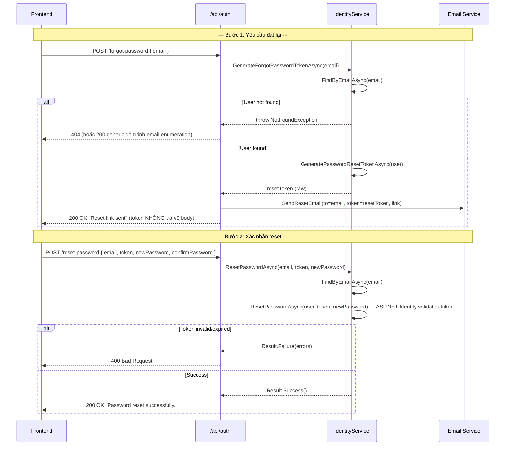

---

### 1.4 Change Password

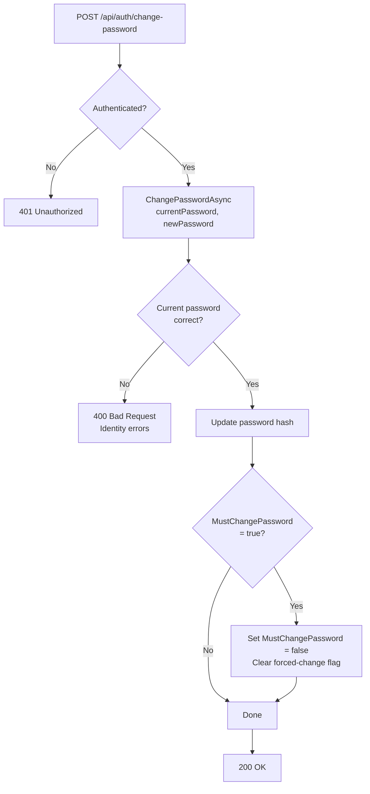

---

## 2. Employee Onboarding Flow

### 2.1 Tạo nhân viên trực tiếp

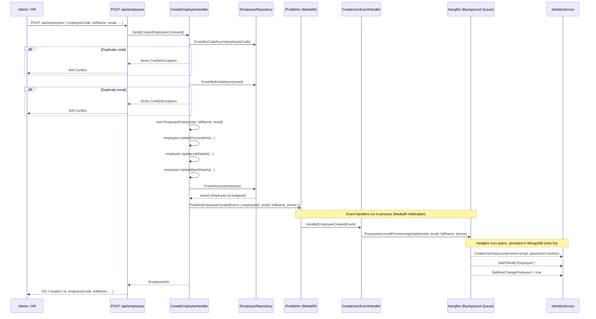

---

### 2.2 Account Provisioning (Event-driven)

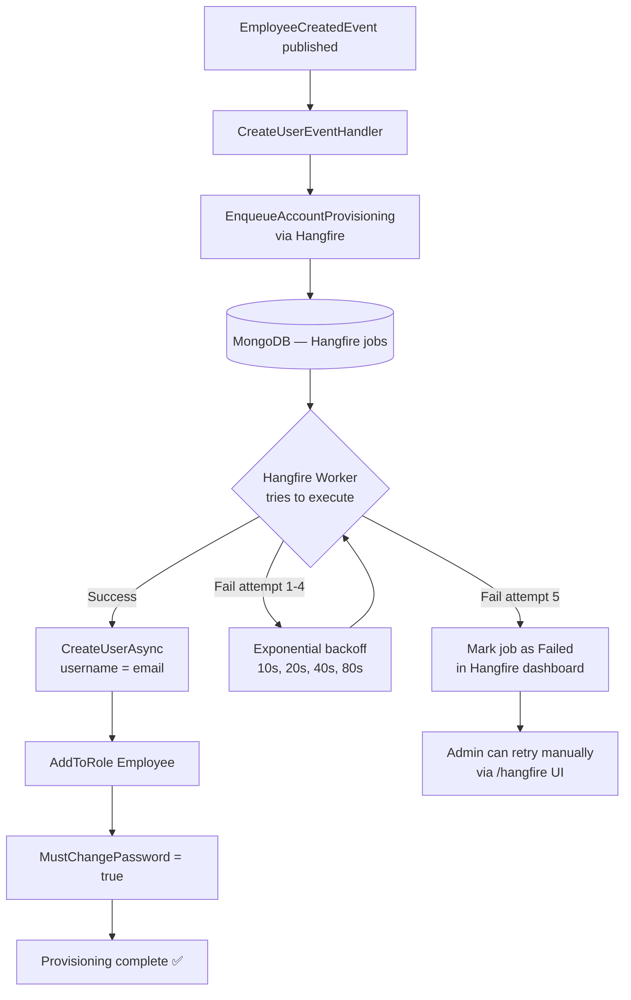

> **Note:** Hangfire persists jobs in MongoDB — nếu server restart giữa chừng, job sẽ được retry tự động khi server khởi động lại.

---

## 3. Leave Request Lifecycle

### 3.1 Submit Leave Request

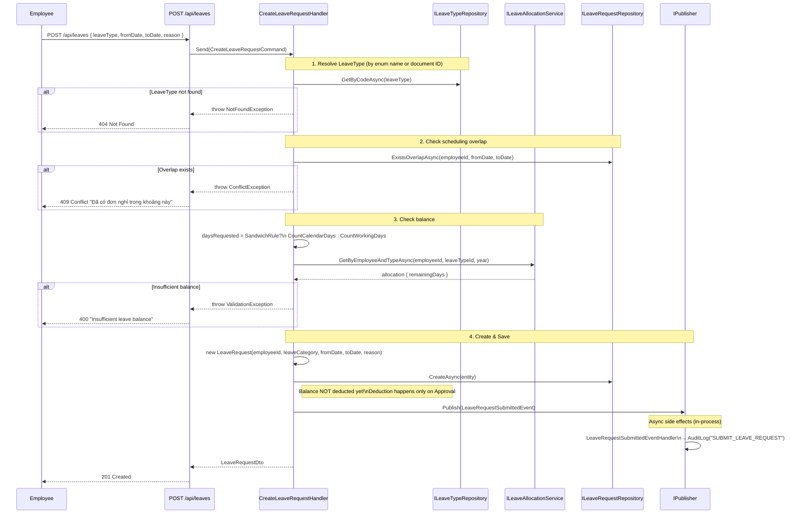

---

### 3.2 Review (Approve / Reject)

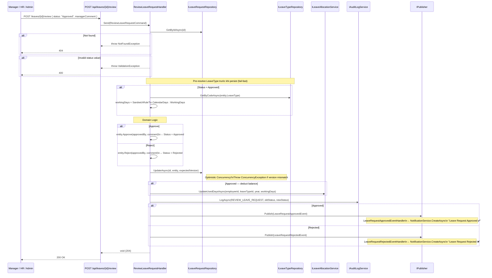

---

### 3.3 State Machine — Leave Request

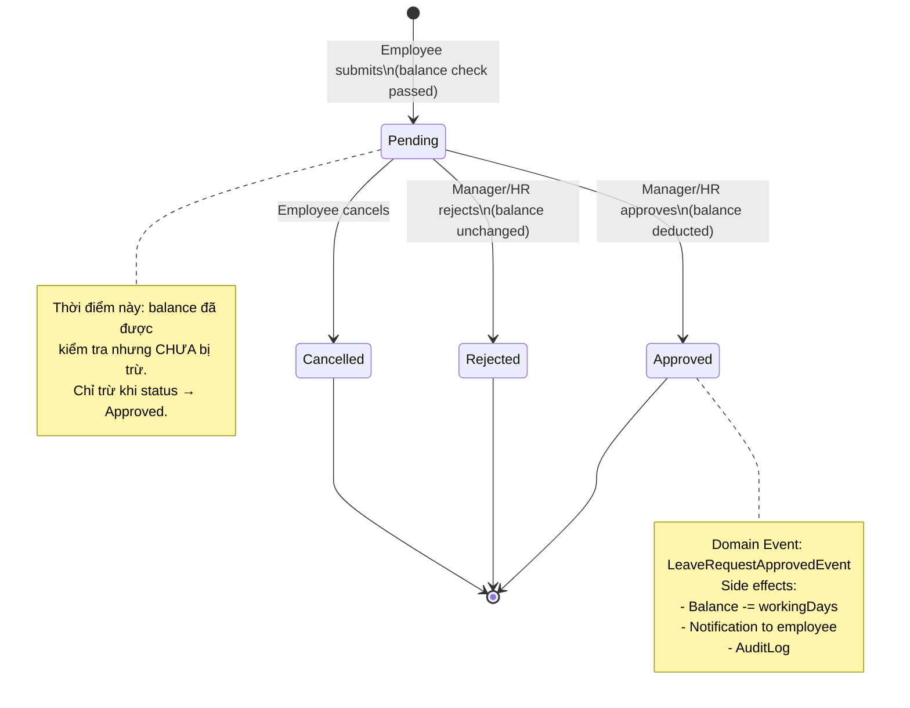

---

## 4. Attendance Processing Pipeline

### 4.1 Check-in / Check-out

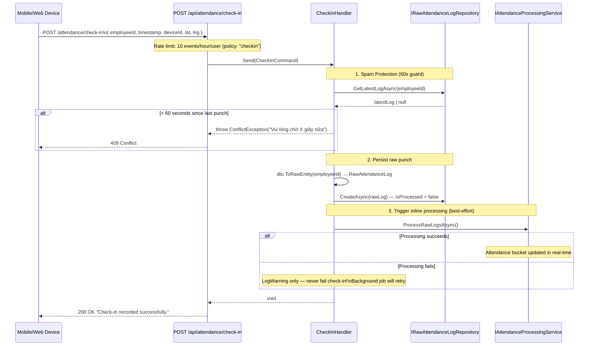

---

### 4.2 Raw Log → Attendance Bucket (Background Processing)

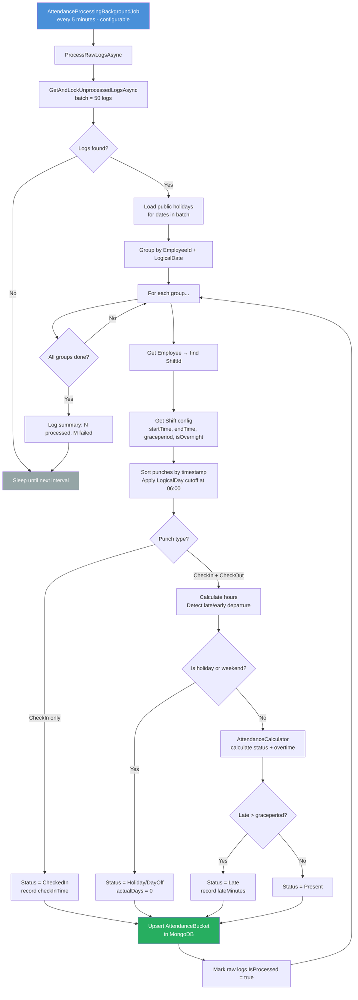

**Logical Day Rule (BUG-01 fix):** Bất kỳ punch nào có giờ local < 06:00 được tính là thuộc **ngày hôm trước** — để ca đêm (check-out lúc 05:30 AM ngày D+1) vẫn nằm trong cùng logical workday với check-in từ tối ngày D.

---

## 5. Payroll Generation Flow

### 5.1 Tổng quan quy trình

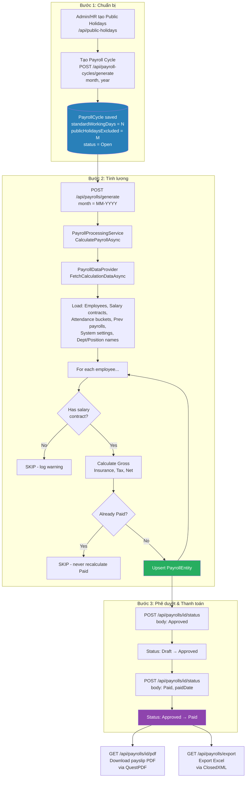

---

### 5.2 Công thức tính lương

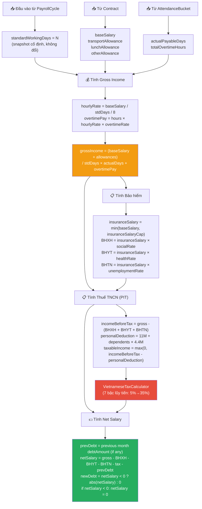

---

### 5.3 Vòng đời trạng thái bảng lương

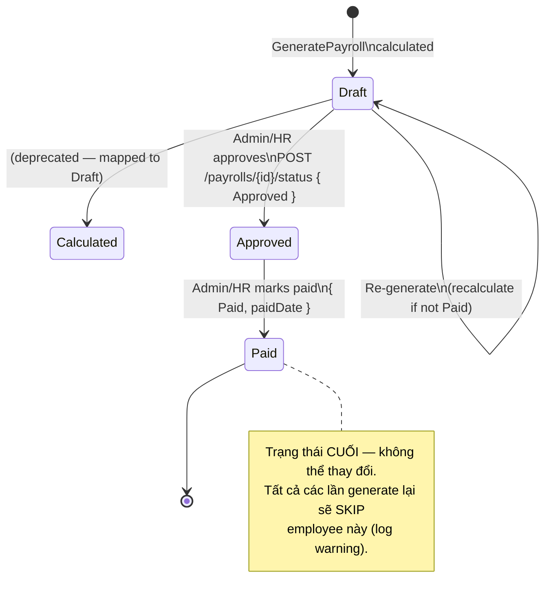

---

## 6. Recruitment Pipeline

### 6.1 Từ Vacancy đến Onboarding

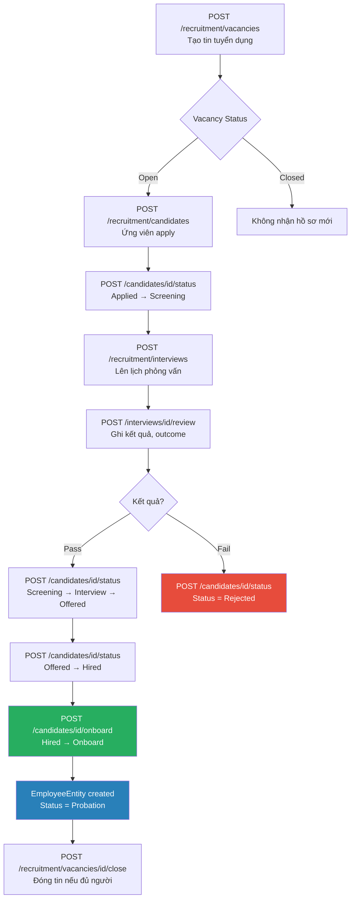

---

### 6.2 Onboard Candidate → Employee

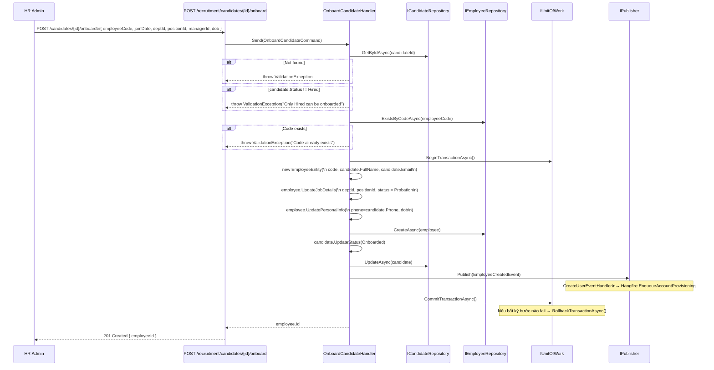

---

### 6.3 State Machine — Candidate

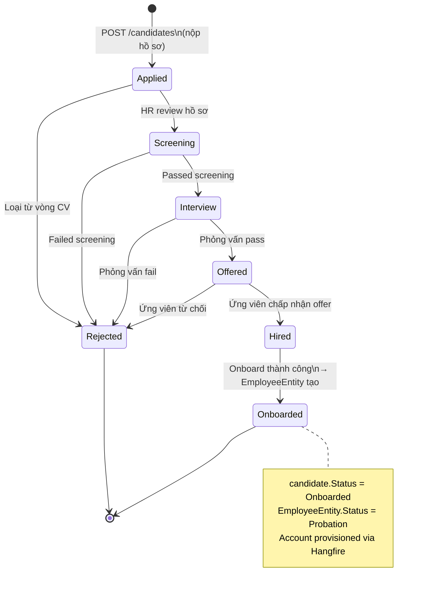

---

## 7. Background Services Schedule

**Tất cả 5 background services** chạy liên tục trong vòng đời ứng dụng (`BackgroundService`), mỗi service có interval cấu hình được qua `appsettings.json`.

```mermaid
gantt
    title Background Jobs Timeline (illustrative)
    dateFormat HH:mm
    axisFormat %H:%M

    section Attendance Processing
    Sweep (every 5 min)     :a1, 00:00, 5m
    Sweep                   :a2, 00:05, 5m
    Sweep                   :a3, 00:10, 5m

    section Leave Accrual
    Check (every 6h)        :l1, 00:00, 6h
    Check                   :l2, 06:00, 6h

    section Payroll Auto-Calculate
    Check (every 12h)       :p1, 00:00, 12h
    Check                   :p2, 12:00, 12h

    section Contract Expiry
    Check (periodic)        :c1, 00:00, 8h

    section Soft Delete Cleanup
    Cleanup (periodic)      :s1, 02:00, 2h
```

**Trigger conditions:**

| Service | Interval | Điều kiện chạy thực tế |
|---|---|---|
| `AttendanceProcessingBackgroundJob` | 5 phút | Luôn chạy — xử lý raw logs tồn đọng |
| `LeaveAccrualBackgroundService` | 6 giờ | Chỉ accrual khi đang ở ngày 1 của tháng |
| `PayrollBackgroundService` | 12 giờ | Chỉ chạy khi `day >= 28` hoặc `day == 1` |
| `ContractExpirationBackgroundService` | Cấu hình | Gửi notification khi hợp đồng sắp hết hạn |
| `SoftDeleteCleanupBackgroundService` | Cấu hình | Xóa vật lý tài liệu đã soft-delete quá lâu |

**Retry logic (tất cả service):**

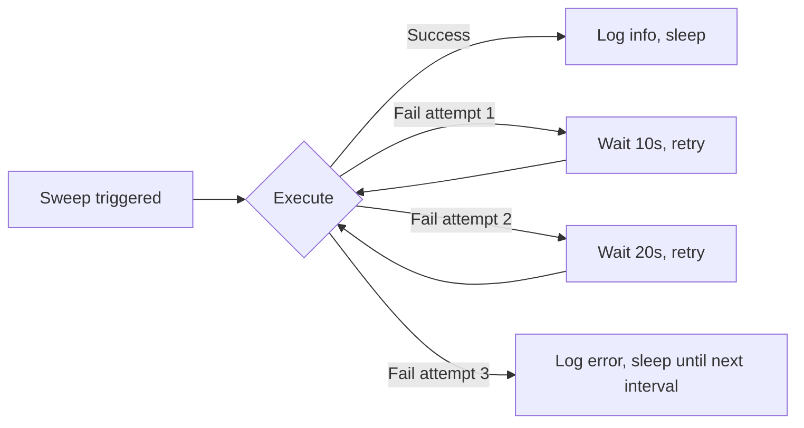

---

## 8. Domain Event Bus

Hệ thống dùng **MediatR `IPublisher`** cho in-process domain events theo pattern `DomainEventNotification<TEvent>`.

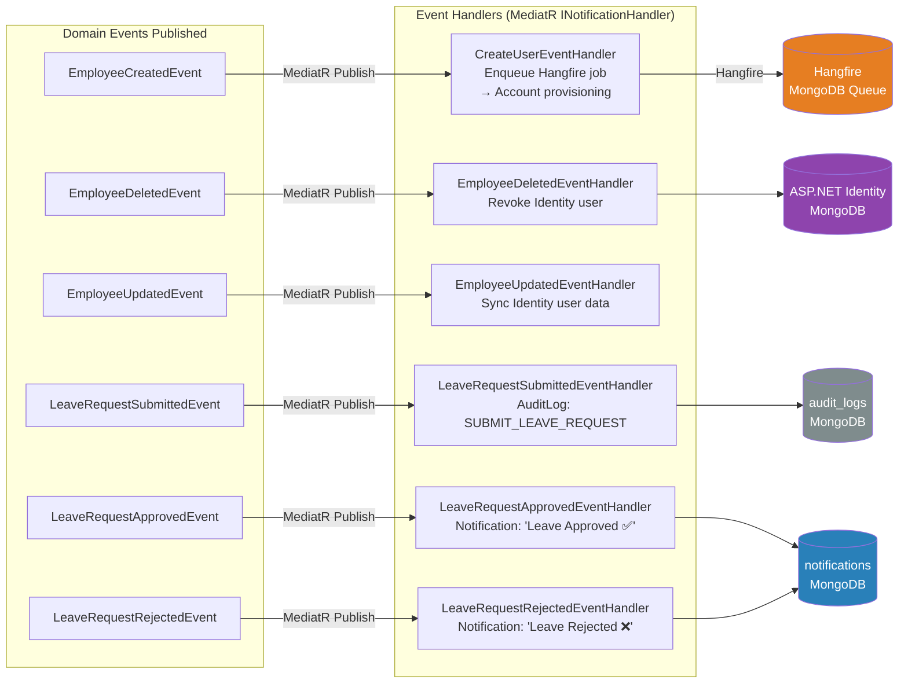

---

## 9. Request Pipeline (Middleware / CQRS)

Mỗi HTTP request đi qua các lớp middleware trước khi đến handler, và response đi ngược lại.

```mermaid
flowchart TD
    REQ[HTTP Request] --> RateLimit[Rate Limiting\nPartitionedRateLimiter]
    RateLimit --> CORS[CORS Policy]
    CORS --> SWAGGER[Swagger / OpenAPI\ndev only]
    SWAGGER --> AUTH_MW[Authentication Middleware\nJWT Bearer validation]
    AUTH_MW --> AUTHZ_MW[Authorization Middleware\nRole checks]
    AUTHZ_MW --> HANGFIRE_FILTER[HangfireAuthFilter\nAdmin-only access\nto /hangfire]
    HANGFIRE_FILTER --> EXCEPTION[GlobalExceptionHandlerMiddleware\nApiResponse wrapper]
    EXCEPTION --> CARTER[Carter Route Matching\nICarterModule endpoints]
    CARTER --> VALIDATOR[FluentValidation\nCommand validators]
    VALIDATOR --> MEDIATR[MediatR Pipeline\nIPipelineBehavior]

    subgraph "MediatR Behaviors"
        MEDIATR --> LOG_BEH[LoggingBehavior\nlog command + duration]
        LOG_BEH --> VALID_BEH[ValidationBehavior\nautomatically runs validators]
        VALID_BEH --> HANDLER[Command/Query Handler]
    end

    HANDLER --> REPO[Repository\nMongoDB Driver]
    REPO --> MONGODB[(MongoDB Atlas)]
    MONGODB --> REPO
    REPO --> HANDLER
    HANDLER --> MEDIATR
    MEDIATR --> CARTER
    CARTER --> EXCEPTION
    EXCEPTION --> RESP[HTTP Response\nApiResponse<T> JSON]

    style REQ fill:#2c3e50,color:#fff
    style RESP fill:#27ae60,color:#fff
    style MONGODB fill:#4db33d,color:#fff
    style EXCEPTION fill:#e74c3c,color:#fff
```

**Exception → HTTP Status mapping** (thực hiện trong `GlobalExceptionHandlerMiddleware`):

| Exception | HTTP Status | ErrorCode |
|---|---|---|
| `ValidationException` | 400 | `VALIDATION_ERROR` |
| `NotFoundException` | 404 | `NOT_FOUND` |
| `ConflictException` | 409 | `CONFLICT` |
| `ConcurrencyException` | 409 | `CONCURRENCY_CONFLICT` |
| `UnauthorizedAccessException` | 401 | `UNAUTHORIZED` |
| `ForbiddenException` | 403 | `FORBIDDEN` |
| `InvalidOperationException` | 409 | `INVALID_STATE` |
| Unhandled `Exception` | 500 | `INTERNAL_ERROR` + correlationId |
